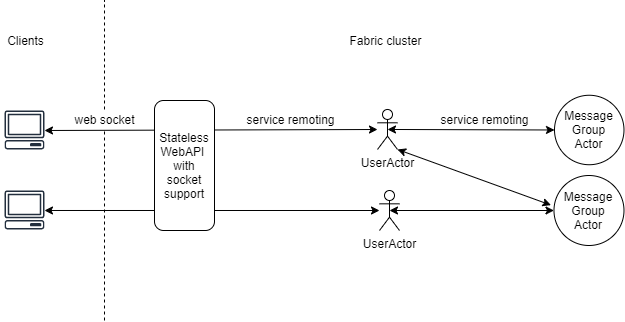

### Describe the approach to the problem and any assumptions 

To approach the problem, the key phases I went through were:
-	Use noun-driven design to list the components, their interaction and clarify any assumption on the application
-	Based on experience, the solution can be done traditionally with a web client, which communicates using HTTP/Websocket with a backend, which will have a persistent layer to manage messages
-	Since Service Fabric was mentioned, I took sometime to learn it and realized its features on top of Actor framework is a very useful model for this particular kind of application. 
-	After having a grasp of Service Fabric, the application on a high level can be as follow

At the same time, I breakdown requirements into Q&A format to concretize the approach and clarify the assumption
- **Use web sockets**: checked
- **Use dotnet core and C# for your solution**: checked (but the web client is a separate SPA)
- **All messages should be stored**: all actor types will use persisted state. The cluster in production will have incremental backup for the persisted state
- **The solution is scalable**: UserActor footprint is small so this won’t be an issue. MessageGroupActor has a larger state size since it has to hold messages, even then it should not be an obstacle when scaling. Notice that the number of groups should be multiple times less than the number of users. There is a bottleneck at the web socket server layer, but that will be mentioned in `Extend.md`
- **The solution is efficient**: there is minimal I/O overhead. For each user connection, an initial handshake between the client and the WebAPI is needed for authentication, the rest are via TCP with websocket and service remoting.
- **The code should be in production quality**: this I assume is about structure, naming, commenting, language feature, etc.
    - Structure: the application justifiable layer of abstraction
    - Naming: must be descriptive and standard
    - Commenting: sufficient, but the code should be descriptive itself
    - Testing: will be discuss more in `Extend.md`
- **Optional: Setup CI/CD for the project**: checked
- **Optional: If you are familiar with Service Fabric, try to use it for this solution**: checked (was not familiar with it, but it's a good opportunity to learn a new paradigm)

